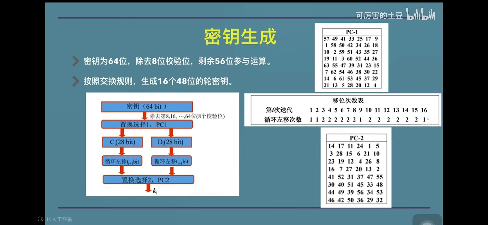

##### des算法作业报告
1. 算法描述  
   - des算法属于分组加密算法，每次加密按8字节一组
   - 算法的主要过程分为三步
     1. 明文进行IP置换
     2. 分左右两组，每组32位，进行16轮操作，每轮操作都是当前这轮的右组作为下轮的左组，而右边一组进行f运算后与左边一组进行异或运算后作为下次的右组
     3. 进行IP逆运算得出结果

   
   其中f运算的过程为：先将32位的右组四个分一组分为6组，每组最后位置添加下一组原来的首元素，每组的最前位置添加上一组原来的尾元素，添加的第一个为原来的最后一个即为第32位，最后一个为原来的第一个即为第一位，此操作后扩展为48位，与当轮子秘钥进行异或运算，然后在经过s盒压缩，最后再进行P置换，得出结果
   
图片如下：

   

   其中子秘钥为48位，一个8组子秘钥，子密码是由原秘钥去除校验位后的56位数据进行PC1置换后，28一组分为左右两组C0和D0，C0和D0按规则进行循环左移后的出新的数据C1和D1，C1和D1拼接后进行PC2置换得出子秘钥，同时该轮得出的C和D作为下次循环左移的起始的元素

如图所示

2. 实测结果
    - 测试1
    - 测试2  
    - 测试3