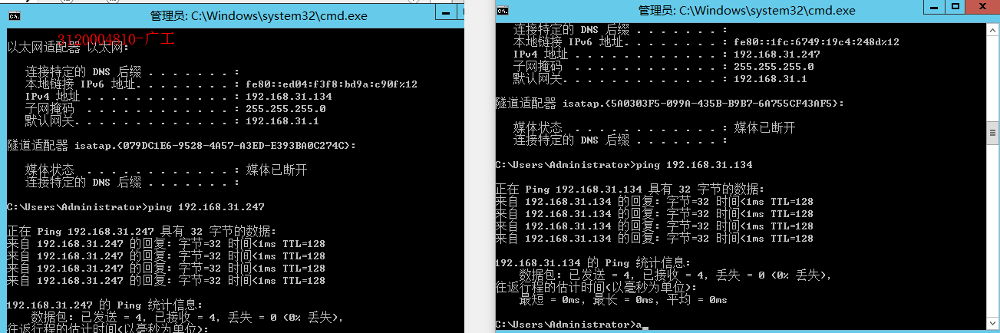
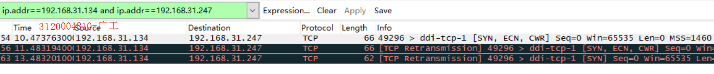
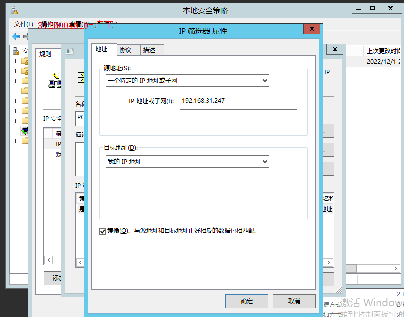
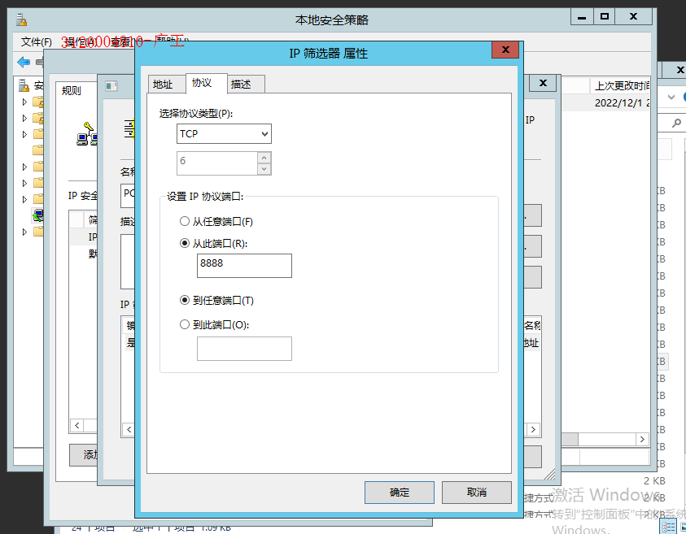
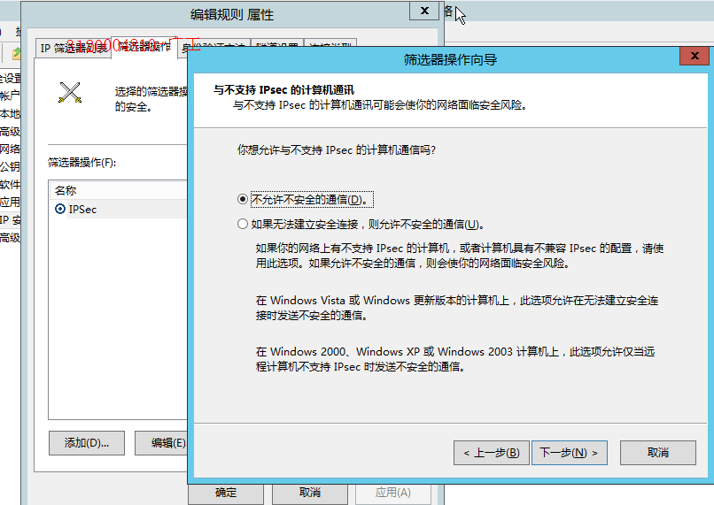
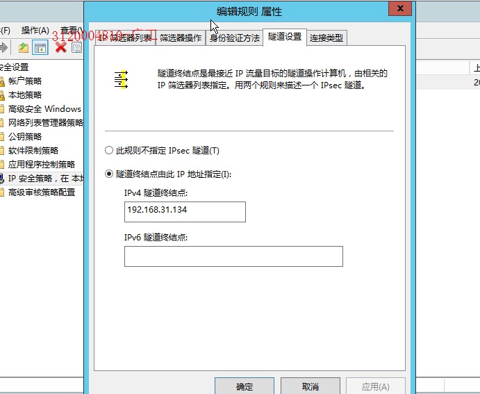
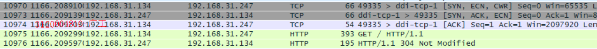

## 实验目的
1. 安装iis组件
2. 配置ipsec协议
3. 用wireShark抓包分别分析
## 实验内容
IPSec ，参考群内的相关文档 配置并抓包分析IPSec协议。
用md格式撰写操作报告，用git管理。
## 实验过程
1. 确认实验设备
    - 服务器端windows 2012
    - 客户端windows 2012
2. IPSec配置
- 因为要实现两个虚拟机之间的通信,所以两台虚拟机的网络连接方式选择桥接
- 互ping
- 
- 按文档在服务器端配置ipsec
3. 指派前抓包
- 
4. 指派后抓包
- 访问
- 
- 
抓包结果三次客户端发送TCP服务器没有回应,IPSec配置成功
5. 在客户端配置IPSec
- 为客户端创建一个安全策略
- IP筛选器如下
- 
- 端口选择从8888到任意，因为访问的服务器端口是8888
- 
- 筛选器选择协议安全
- 
- 添加隧道
- 
- 更改服务器的筛选器,因为一开始设置的筛选器是阻止,现在也改为协议安全
- 服务器也添加隧道
- 
- 隧道终结点为最接近流量目标的地址所以填自己的地址
- 访问测试
- 
- 抓包分析
- 
- 成功通信
## 实验小结  
了解了IPSec是端到端的协议以及其工作的过程
