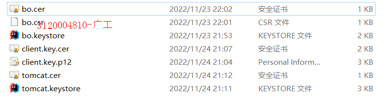
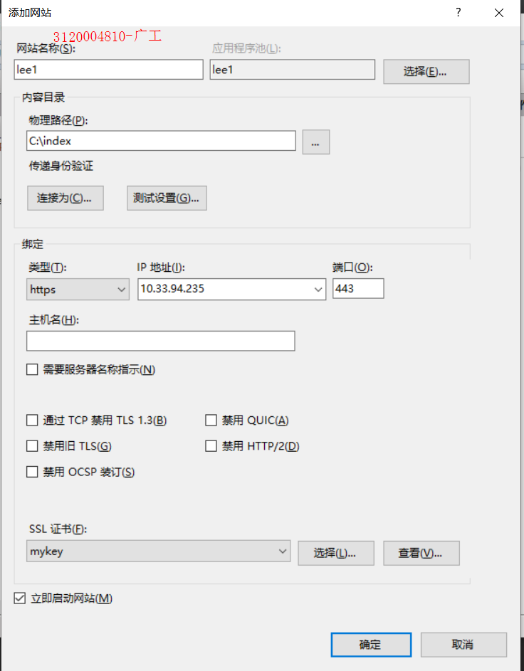
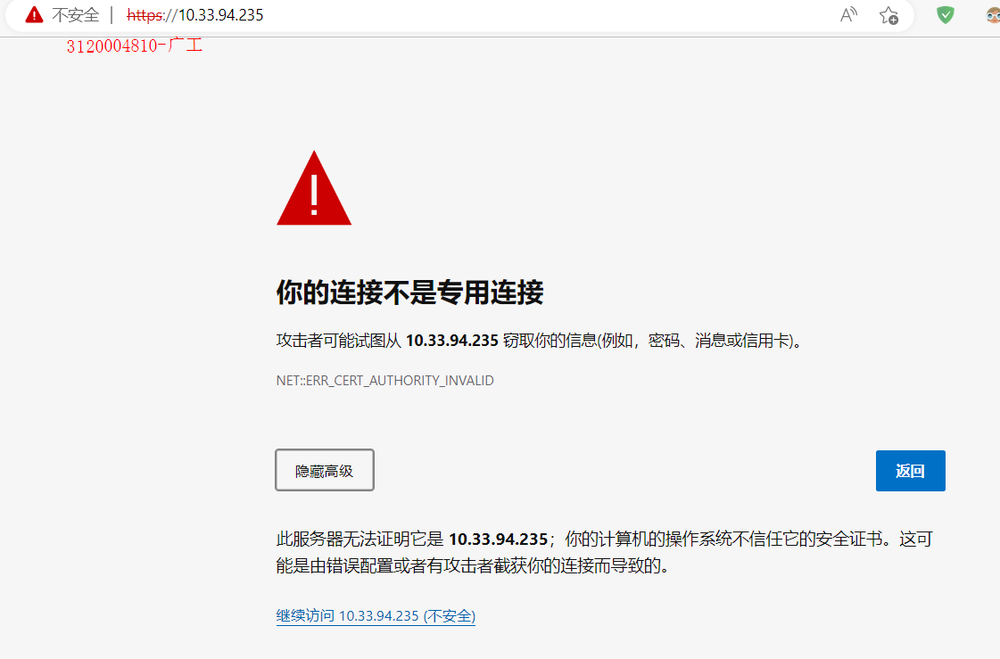

## 实验目的 
了解证书的用处以及其从申请，创建，分发到使用的过程
## 实验内容
在个人熟悉的平台上搜索下载安装PKI平台软件。练习证书的申请，创建，分发等操作。
用md格式撰写操作报告，用git管理。

## 实验过程

1. pki是什么  
   PKI是一种遵循标准的利用公钥加密技术为电子商务的开展提供一套安全基础平台的技术和规范
2. pki的组成部分  
   - 认证中心CA
   - X.500 目录服务器
   - 具有高强度密码算法(SSL)
   - Web（安全通信平台）
   - 自开发安全应用系统
3. CA认证的作用  
  无论是对称加密还是非对称加密,都遗留了一个问题没有解决,那就是如何证明我们访问的网站就是我们要访问的网站,而不是他人伪造的,即中间人攻击和信息抵赖的问题,这里就用到了证书,而证书也一样，怎么知道这个证书的可信度,这就需要ca认证,被认证的置为可信。  
认证过程  
  - 
    1. 服务方S向第三方机构CA提交公钥、组织信息、个人信息(域名)等信息并申请认证;

    2. CA通过线上、线下等多种手段验证申请者提供信息的真实性，如组织是否存在、企业是否合法，是否拥有域名的所有权等;

    3. 如信息审核通过，CA会向申请者签发认证文件-证书。

       证书包含以下信息：申请者公钥、申请者的组织信息和个人信息、签发机构CA的信息、有效时间、证书序列号等信息的明文，同时包含一个签名;

       签名的产生算法：首先，使用散列函数计算公开的明文信息的信息摘要，然后，采用CA的私钥对信息摘要进行加密，密文即签名;

    4. 客户端 C 向服务器 S 发出请求时，S 返回证书文件;

    5. 客户端 C 读取证书中的相关的明文信息，采用相同的散列函数计算得到信息摘要，然后，利用对应CA的公钥解密签名数据，对比证书的信息摘要，如果一致，则可以确认证书的合法性，即公钥合法;

    6. 客户端然后验证证书相关的域名信息、有效时间等信息;

    7. 客户端会内置信任CA的证书信息(包含公钥)，如果CA不被信任，则找不到对应 CA的证书，证书也会被判定非法。  
   
  4. 用java自带的keytool来实现以上操作
   - 生成服务器证书  
   keytool -genkey -v -alias tomcat -keyalg RSA -keystore E:\keystore\tomcat.keystore -validity 36500
   - 生成客户端证书  
     keytool -genkey -v -alias mykey -keyalg RSA -storetype PKCS12 -keystore
     E:\keystore\client.key.p12
   - 将客户端证书导出为cer文件  
     keytool -export -alias mykey -keystore E:\keystore\client.key.p12 -storetype PKCS12 -storepass 123456 -rfc -file E:\keystore\client.key.cer
   - 使服务器信任客户端证书
   - 将客户端的cer文件导入服务器的证书库
     keytool -import -v -file E:\keystore\client.key.cer -keystore E:\keystore\tomcat.keystore
   - 使客户端信任服务器证书
   - 将服务器证书导出为cer文件  
     keytool -keystore E:\keystore\\tomcat.keystore -export -alias tomcat -file E:\keystore\tomcat.cer
   - keystore 结果截图
   - 
   - 
   - 通过IIS创建本地网站
   - 
    
   网站名称选择lee1,物理地址选择D:\index,index里有一个index.html,连接成功显示helloworld
   类型选择https,因为要分发证书，ip地址选择可选的任意一个，ssl证书选择mykey,mykey为上面创建的客户端证书
   - 连接该网站
   -   
      发出警告因为该证书是自己颁发给自己的，不受信任
   - 
       点击继续访问，显示helloworld,连接成功
   - 当然可以申请一个ca认证的证书(例如:去阿里云申请免费证书)，但是没有可用域名故不作实验
## 实验小结
本次实验了解到了一些与pki相关的知识，了解了证书的作用，使用了java中的keytool来实现证书的申请，创建，并通过IIS把证书分发给创建的网站