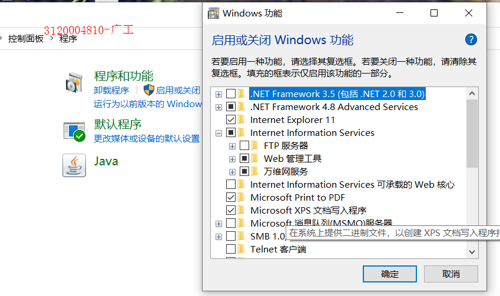
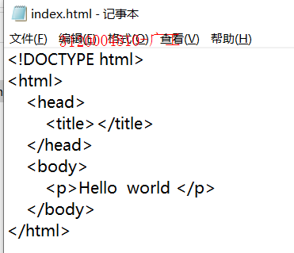

## 实验目的
1. 安装iis组件，配置ssl协议
2. 用wireShark抓包分别分析
## 实验内容
SSL ，参考群内的相关文档 配置并抓包分析 SSL协议。
用md格式撰写操作报告，用git管理。
## 实验过程
1. 确认实验设备
    - 服务器端windows 10
    - 客户端同一局域网下的一台手机
2. 安装IIS组件  

3. 创建网站

名称为lee,物理路径为C:\index,因为要与配置sslh后作对比故选择http类型，ip选本机ip
4. 编辑index  

5. 预览  

配置成功
6. 使用客户端连接该网站，并使用wireshark抓包

客户端访问成功

wireshark抓包
分析:
第一行TCP协议，第一次握手，客户端发出[SYN]包seq=0(自己确定的)，请求连接，等待服务器回应  
第二行TCP协议，第二次握手，服务器收到[SYN]包后，确认序号seq=0,然后发送[SYN,ACK]包,该包的ACK=1,因为为确认报文,seq=0(自己确定的),ack=1,ack为确认号字段,因为刚刚收到的[SYN]包里的
seq=0,所以希望下次收到的应该是1  
第三行TCP协议，第三次握手，客户端收到了服务器发送过来的[SYN,ACk]包后，向服务器发送确认包[SYN,ACK],ACK=1就是该报文段是确认字段的意思，seq=1,因为收到来自服务器的[SYN,ACK]
中的ack=1,ack=1,因为刚刚收到来自服务器的[SYN,ACK]包中seq=0  
第四行HTTP协议，GET命令，客户端请求从服务器获取index.html资源  
第五行HTTP协议，报304状态码，not modify 指没有修改，服务器告诉客户端没有该资源修改，可继续使用之前缓存的资源，如果是第一次访问或者内容被修改亦或者打开无痕浏览又或清除cookie等情况，则返回状态码200 OK，表示一切正常
如下图:

可以看到所传输的内容，因为http是明文传输协议
7. 导入证书
  
该证书为上个实验生成的，所以下面实验中提示不安全是正常的
  
名称为leehttps以示区分,物理地址同上，协议选择https,因为要配置ssl,证书选择mykey,这是上一个实验的产物，为了方便所以决定这次实验使用它  
8. 预览

可以通过https访问，配置成功
9. 使用客户端连接该网站，并使用wireshark抓包   
客户端访问该网站
  
  
因为mykey是自签名证书，没有任何CA认证所以警告
  
成功访问  
wireshark抓包
  
- TCP的三次握手建立连接后，开始SSL握手  
- 用户发出CLient Hello   

含有客户端所支持的版本号;客户端生成的随机数,用于检验服务器是否为目标服务器;会话ID,第一次访问为空,此次不为空,证明之前访问过,缓存中保留了该服务器的链接信息;
客户端支持的加密套件;压缩算法  
- 服务器接收Client Hello后,回复Sever Hello
  
含有版本号;加密后的随机数;会话ID;选择的加密套件;选择的压缩算法,此处为null,指不需压缩;服务器的证书;Server Key Exchange,用于传递密码算法参数;Hello Done,告诉客户端握手信息结束  
- 客户端回复ACK确认报文  
- 确认对方服务器为目标服务器后,发送Client key Exchange,用于让服务器计算秘钥,Change Cipher Spec  通知服务器之后通信开始使用对称秘钥通信  
- 客户端发出Application Data
  
这里可以看出已经进行加密通信,无法查看明文  
- 服务器接收到用户端的Client key Exchange后发出ACk确认报文
- 根据接收到Client Key Exchange计算出之后通信所需的对称加密秘后,发出Change Cipher Spec,通知用户端准备完毕之后用协商好的对称秘钥进行通信,此时SSL握手结束
- 解密用户端发送的Application Data,用同样的方式将用户端所需的数据发送出去  
## 实验小结
本次实验了解到了SSL协议的过程，对网络安全有了更深的理解
