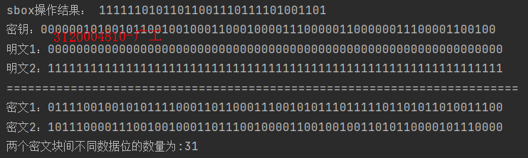
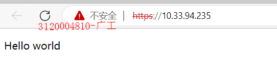
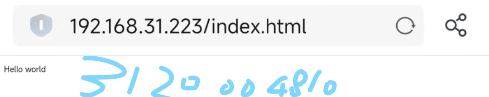
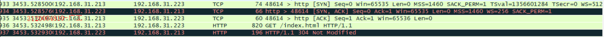
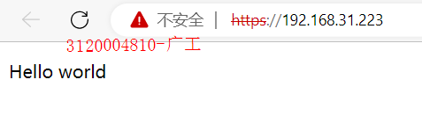
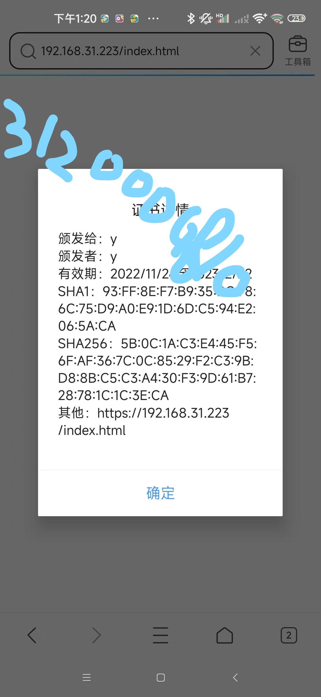
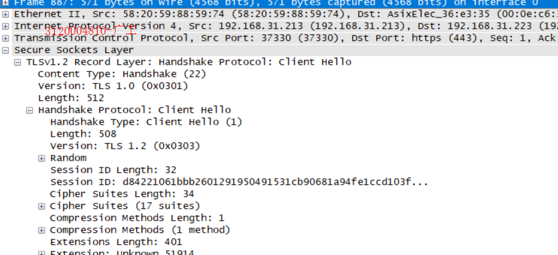
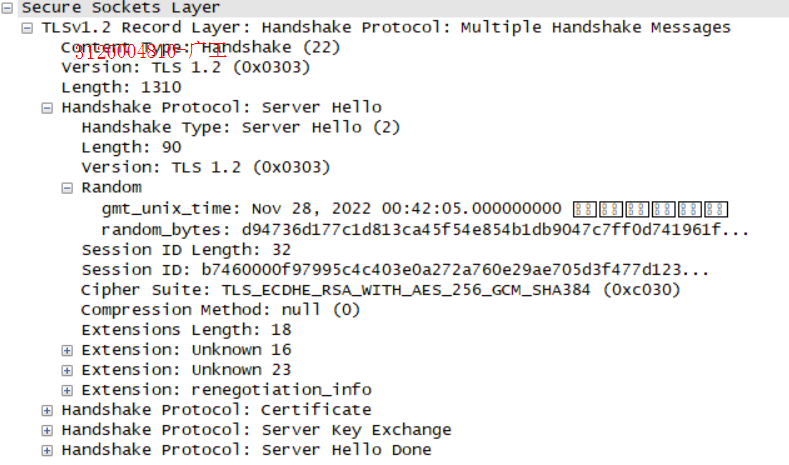

#####目录
######实验一 密码算法
1. DES算法实验
2. DH算法实验
3. RSA算法实验
######实验二 安全协议算法
1. PKI实验
2. SSL实验
3. IPSec实验

##实验一 密码算法
###DES算法实验
####实验目的
1. 掌握DES算法基本原理
2. 了解DES算法的详细步骤
####实验内容
1. 网上搜索DES的源代码。
2. 利用DES源代码实现下面功能：
   1. 给定某个Sbox的输入差分情况下，计算所有输入对和所有Sbox输出差分的分布情况//s盒操作时输出即可
   2. 统计DES算法在密钥固定情况，输入明文改变1位、2位，。。。64位时。输出密文位数改变情况。//写函数逐位改变
   3. 统计DES算法在明文固定情况，输入密钥改变1位、2位，。。。64位时。输出密文位数改变情况。
   4.  为了具有客观性，2，3小题需要对多次进行统计，并计算其平均值
####实验过程

1. 算法描述
    - des算法属于分组加密算法，每次加密按8字节一组
    - 算法的主要过程分为三步
        1. 明文进行IP置换
        2. 分左右两组，每组32位，进行16轮操作，每轮操作都是当前这轮的右组作为下轮的左组，而右边一组进行f运算后与左边一组进行异或运算后作为下次的右组
        3. 进行IP逆运算得出结果

其中f运算的过程为：先将32位的右组四个分一组分为6组，每组最后位置添加下一组原来的首元素，
每组的最前位置添加上一组原来的尾元素，添加的第一个为原来的最后一个即为第32位，
最后一个为原来的第一个即为第一位，此操作后扩展为48位，与当轮子秘钥进行异或运算，
然后在经过s盒压缩，最后再进行P置换，得出结果  
其中子秘钥为48位，一个8组子秘钥，子密码是由原秘钥去除校验位后的56位数据进行PC1置换后，
28一组分为左右两组C0和D0，C0和D0按规则进行循环左移后的出新的数据C1和D1，
C1和D1拼接后进行PC2置换得出子秘钥，同时该轮得出的C和D作为下次循环左移的起始的元素
2. 实测结果
    - 测试1
    - 测试2
    - 测试3
####实验小结
通过本次DES算法了解其基本原理和详细步骤
###DH算法实验
####实验目的
1. 掌握 DH 运算的基本原理
2. 了解 DH 运算的实现方法
####实验内容
编程实现 DH 密钥协商协议
共同参数。素数P，P的一个生成元g
1. A 随机选择一个 [1,p-1] 范围内的数`x`，计算 `X` = g^x
2. B 随机选择一个 [1,p-1] 范围内的数`y`，计算 `Y` = g^y mod p, 并将结果发送给A。
k` = Y^x = X^y  
实验提示  
编写 bool isPrime(int n) ; 判断 n是素数
编写 int GCD(int a, int b); 计算 a，b最大公因子
编写 int ExpMod(int b, int n, int m) 计算 b^n mod m .
编写 bool isPrimeRoot(g, p); 判断 g是模p乘的生成元。//找本原根
寻找p的生成元 ，从 g 从2，3等较小的数开始进行穷举。 计算 g^n mod p ， 1<=n < p-1 的到的数据不同，g即为生成元。
可以在网上搜集相应的算法即源代码，但不能使用语言提供的函数直接的出结果。
####实验过程
1. DH算法简介
   - 由Diffie和Hellen提出，是最早的公钥密码系统
   - 优点：需要时才生成，减少被攻击的机会；除了约定全局参数不需要约定其他的
   - 缺点：容易遭受中间人攻击
2. 算法过程
   1. 选择一个大素数p,并计算出它的本元根a
   2. 用户A,B建立连接,用户A从1到p-1中选出Xa,用户B从1到p-1中选出Xb
   3. 用户A通过计算Ya=a^Xamodp得出Ya,并发给用户B
   4. 用户B通过计算Yb=a^Xbmodp得出Yb,并发给用户A
   5. 用户A计算K=Yb^Xamodp,用户B计算k=Ya^Xbmodp,得出共享秘钥K
3. 测试结果

####实验小结
DES对64(bit)位的明文分组M进行操作，M经过一个初始置换IP置换成m0，
将m0明文分成左半部分和右半部分m0=(L0,R0)，各32位长。
然后进行16轮完全相同的运算，这些运算被称为函数f，
在运算过程中数据与密钥结合。经过16轮后，左，右半部分合在一起经过一个末置换，
这样就完成了[12]。在每一轮中，密钥位移位，然后再从密钥的56位中选出48位。
通过一个扩展置换将数据的右半部分扩展成48位，并通过一个异或操作替代成新的32位数据，
在将其置换一次。这四步运算构成了函数f。然后，通过另一个异或运算，函数f的输出与左半部分结合，
其结果成为新的右半部分，原来的右半部分成为新的左半部分。将该操作重复16次，就实现了。
DES加密和解密唯一的不同是密钥的次序相反。如果各轮加密密钥分别是K1,K2,K3….K16
那么解密密钥就是K16,K15,K14…K1。
###RSA算法实验
####实验目的
1. 了解 RSA 算法的基本原理
2. 掌握 RSA 算法的实现方法
####实验内容
编程实现RSA基本算法
计算 ：在一个RSA系统中，一个给定用户的公钥 e = 31, n = 3599.求这个用户的私有密钥。
要求
1. 选用自己熟悉的语言实现上述要求。上交内容包括程序源代码和一份简单的实验报告（电子版本md格式）
2. 写在作业本上，每页写上自己的学号，姓名，然后拍照。拍照后的电子照片适当压缩（缩小分辨率），以一张不超过200K为限。
3. 用git管理
####实验过程
1. RSA算法是由Rivet,Shemir,Adleman提出，是早批提出的且被广泛实现的公钥算法
2. 算法过程
   - 选择两个不同的大素数p,q(大于1且因数只有1和本身的自然数)
   - 计算两者乘积n
   - 根据欧拉公式Φ(n)=(p-1)(q-1),所得出的结果是小于n且与n互质的数的个数
   - 从小于Φ(n)大于1的且与Φ(n)互质的数中随机选择一个数e,得出公钥<e,n>
   - 再计算(e*d)mod(Φ(n))=1,得出d,得出私钥<d,n>
3. 测试结果

####实验小结
RSA的公钥和私钥都是两个大素数（ 大于 100个十进制位）的函数。
据猜测，从一个密钥和密文推断出明文的难度等同于分解两个大素数的积。密钥对的产生。
选择两个大素数，p 和q 。计算：n = p * q然后随机选择加密密钥e，要求 e 和 ( p - 1 ) * ( q - 1 ) 互质。
最后，利用Euclid 算法计算解密密钥d, 满足e * d = 1 ( mod ( p - 1 ) * ( q - 1 ) )其中n和d也要互质。
数e和n是公钥，d是私钥。两个素数p和q不再需要，应该丢弃，不要让任何人知道。
加密信息 m（二进制表示）时，首先把m分成等长数据块 m1 ,m2,..., mi ，块长s，其中 2^s <= n, s 尽可能的大。
对应的密文是：ci = mi^e ( mod n ) ( a )解密时作如下计算：mi = ci^d ( mod n ) ( b )。
##实验二 安全协议算法
###PKI实验
#### 实验目的
了解证书的用处以及其从申请，创建，分发到使用的过程
#### 实验内容
在个人熟悉的平台上搜索下载安装PKI平台软件。练习证书的申请，创建，分发等操作。
用md格式撰写操作报告，用git管理。

#### 实验过程

1. pki是什么  
   PKI是一种遵循标准的利用公钥加密技术为电子商务的开展提供一套安全基础平台的技术和规范
2. pki的组成部分
   - 认证中心CA
   - X.500 目录服务器
   - 具有高强度密码算法(SSL)
   - Web（安全通信平台）
   - 自开发安全应用系统
3. CA认证的作用  
   无论是对称加密还是非对称加密,都遗留了一个问题没有解决,那就是如何证明我们访问的网站就是我们要访问的网站,而不是他人伪造的,即中间人攻击和信息抵赖的问题,这里就用到了证书,而证书也一样，怎么知道这个证书的可信度,这就需要ca认证,被认证的置为可信。  
   认证过程
- 
   1. 服务方S向第三方机构CA提交公钥、组织信息、个人信息(域名)等信息并申请认证;

   2. CA通过线上、线下等多种手段验证申请者提供信息的真实性，如组织是否存在、企业是否合法，是否拥有域名的所有权等;

   3. 如信息审核通过，CA会向申请者签发认证文件-证书。

      证书包含以下信息：申请者公钥、申请者的组织信息和个人信息、签发机构CA的信息、有效时间、证书序列号等信息的明文，同时包含一个签名;

      签名的产生算法：首先，使用散列函数计算公开的明文信息的信息摘要，然后，采用CA的私钥对信息摘要进行加密，密文即签名;

   4. 客户端 C 向服务器 S 发出请求时，S 返回证书文件;

   5. 客户端 C 读取证书中的相关的明文信息，采用相同的散列函数计算得到信息摘要，然后，利用对应CA的公钥解密签名数据，对比证书的信息摘要，如果一致，则可以确认证书的合法性，即公钥合法;

   6. 客户端然后验证证书相关的域名信息、有效时间等信息;

   7. 客户端会内置信任CA的证书信息(包含公钥)，如果CA不被信任，则找不到对应 CA的证书，证书也会被判定非法。

4. 用java自带的keytool来实现以上操作
- 生成服务器证书  
  keytool -genkey -v -alias tomcat -keyalg RSA -keystore E:\keystore\tomcat.keystore -validity 36500
- 生成客户端证书  
  keytool -genkey -v -alias mykey -keyalg RSA -storetype PKCS12 -keystore
  E:\keystore\client.key.p12
- 将客户端证书导出为cer文件  
  keytool -export -alias mykey -keystore E:\keystore\client.key.p12 -storetype PKCS12 -storepass 123456 -rfc -file E:\keystore\client.key.cer
- 使服务器信任客户端证书
- 将客户端的cer文件导入服务器的证书库
  keytool -import -v -file E:\keystore\client.key.cer -keystore E:\keystore\tomcat.keystore
- 使客户端信任服务器证书
- 将服务器证书导出为cer文件  
  keytool -keystore E:\keystore\\tomcat.keystore -export -alias tomcat -file E:\keystore\tomcat.cer
- keystore 结果截图
- 
- 
- 通过IIS创建本地网站
- 

网站名称选择lee1,物理地址选择D:\index,index里有一个index.html,连接成功显示helloworld
类型选择https,因为要分发证书，ip地址选择可选的任意一个，ssl证书选择mykey,mykey为上面创建的客户端证书
- 连接该网站
-   
  发出警告因为该证书是自己颁发给自己的，不受信任
- 
  点击继续访问，显示helloworld,连接成功
- 当然可以申请一个ca认证的证书(例如:去阿里云申请免费证书)，但是没有可用域名故不作实验
#### 实验小结
本次实验了解到了一些与pki相关的知识，了解了证书的作用，
使用了java中的keytool来实现证书的申请，创建，并通过IIS把证书分发给创建的网站
###SSL实验
#### 实验目的
1. 安装iis组件，配置ssl协议
2. 用wireShark抓包分别分析
#### 实验内容
SSL ，参考群内的相关文档 配置并抓包分析 SSL协议。
用md格式撰写操作报告，用git管理。
#### 实验过程
1. 确认实验设备
   - 服务器端windows 10
   - 客户端同一局域网下的一台手机
2. 安装IIS组件  
   
3. 创建网站
   
   名称为lee,物理路径为C:\index,因为要与配置sslh后作对比故选择http类型，ip选本机ip
4. 编辑index  
   
5. 预览  
   
   配置成功
6. 使用客户端连接该网站，并使用wireshark抓包
   
   客户端访问成功
   
   wireshark抓包
   分析:
   第一行TCP协议，第一次握手，客户端发出[SYN]包seq=0(自己确定的)，请求连接，等待服务器回应  
   第二行TCP协议，第二次握手，服务器收到[SYN]包后，确认序号seq=0,然后发送[SYN,ACK]包,该包的ACK=1,因为为确认报文,seq=0(自己确定的),ack=1,ack为确认号字段,因为刚刚收到的[SYN]包里的
   seq=0,所以希望下次收到的应该是1  
   第三行TCP协议，第三次握手，客户端收到了服务器发送过来的[SYN,ACk]包后，向服务器发送确认包[SYN,ACK],ACK=1就是该报文段是确认字段的意思，seq=1,因为收到来自服务器的[SYN,ACK]
   中的ack=1,ack=1,因为刚刚收到来自服务器的[SYN,ACK]包中seq=0  
   第四行HTTP协议，GET命令，客户端请求从服务器获取index.html资源  
   第五行HTTP协议，报304状态码，not modify 指没有修改，服务器告诉客户端没有该资源修改，可继续使用之前缓存的资源，如果是第一次访问或者内容被修改亦或者打开无痕浏览又或清除cookie等情况，则返回状态码200 OK，表示一切正常
   如下图:
   
   
   可以看到所传输的内容，因为http是明文传输协议
7. 导入证书
     
   该证书为上个实验生成的，所以下面实验中提示不安全是正常的
     
   名称为leehttps以示区分,物理地址同上，协议选择https,因为要配置ssl,证书选择mykey,这是上一个实验的产物，为了方便所以决定这次实验使用它
8. 预览
   
   可以通过https访问，配置成功
9. 使用客户端连接该网站，并使用wireshark抓包   
   客户端访问该网站
     
     
   因为mykey是自签名证书，没有任何CA认证所以警告
     
   成功访问  
   wireshark抓包
   
- TCP的三次握手建立连接后，开始SSL握手
- 用户发出CLient Hello   
  
  含有客户端所支持的版本号;客户端生成的随机数,用于检验服务器是否为目标服务器;会话ID,第一次访问为空,此次不为空,证明之前访问过,缓存中保留了该服务器的链接信息;
  客户端支持的加密套件;压缩算法
- 服务器接收Client Hello后,回复Sever Hello
    
  含有版本号;加密后的随机数;会话ID;选择的加密套件;选择的压缩算法,此处为null,指不需压缩;服务器的证书;Server Key Exchange,用于传递密码算法参数;Hello Done,告诉客户端握手信息结束
- 客户端回复ACK确认报文
- 确认对方服务器为目标服务器后,发送Client key Exchange,用于让服务器计算秘钥,Change Cipher Spec  通知服务器之后通信开始使用对称秘钥通信
- 客户端发出Application Data
    
  这里可以看出已经进行加密通信,无法查看明文
- 服务器接收到用户端的Client key Exchange后发出ACk确认报文
- 根据接收到Client Key Exchange计算出之后通信所需的对称加密秘后,发出Change Cipher Spec,通知用户端准备完毕之后用协商好的对称秘钥进行通信,此时SSL握手结束
- 解密用户端发送的Application Data,用同样的方式将用户端所需的数据发送出去
#### 实验小结
本次实验了解到了SSL协议的过程，对网络安全有了更深的理解

###IPSec实验
#### 实验目的
1. 安装iis组件
2. 配置ipsec协议
3. 用wireShark抓包分别分析
#### 实验内容
IPSec ，参考群内的相关文档 配置并抓包分析IPSec协议。
用md格式撰写操作报告，用git管理。
#### 实验过程
1. 确认实验设备
   - 服务器端windows 2012
   - 客户端windows 2012
2. IPSec配置
- 因为要实现两个虚拟机之间的通信,所以两台虚拟机的网络连接方式选择桥接
- 互ping
- 
- 按文档在服务器端配置ipsec
3. 指派前抓包
- 
4. 指派后抓包
- 访问
- 
- 
  抓包结果三次客户端发送TCP服务器没有回应,IPSec配置成功
5. 在客户端配置IPSec
- 为客户端创建一个安全策略
- IP筛选器如下
- 
- 端口选择从8888到任意，因为访问的服务器端口是8888
- 
- 筛选器选择协议安全
- 
- 添加隧道
- 
- 更改服务器的筛选器,因为一开始设置的筛选器是阻止,现在也改为协议安全
- 服务器也添加隧道
- 
- 隧道终结点为最接近流量目标的地址所以填自己的地址
- 访问测试
- 
- 抓包分析
- 
- 成功通信
#### 实验小结
了解了IPSec是端到端的协议以及其工作的过程

